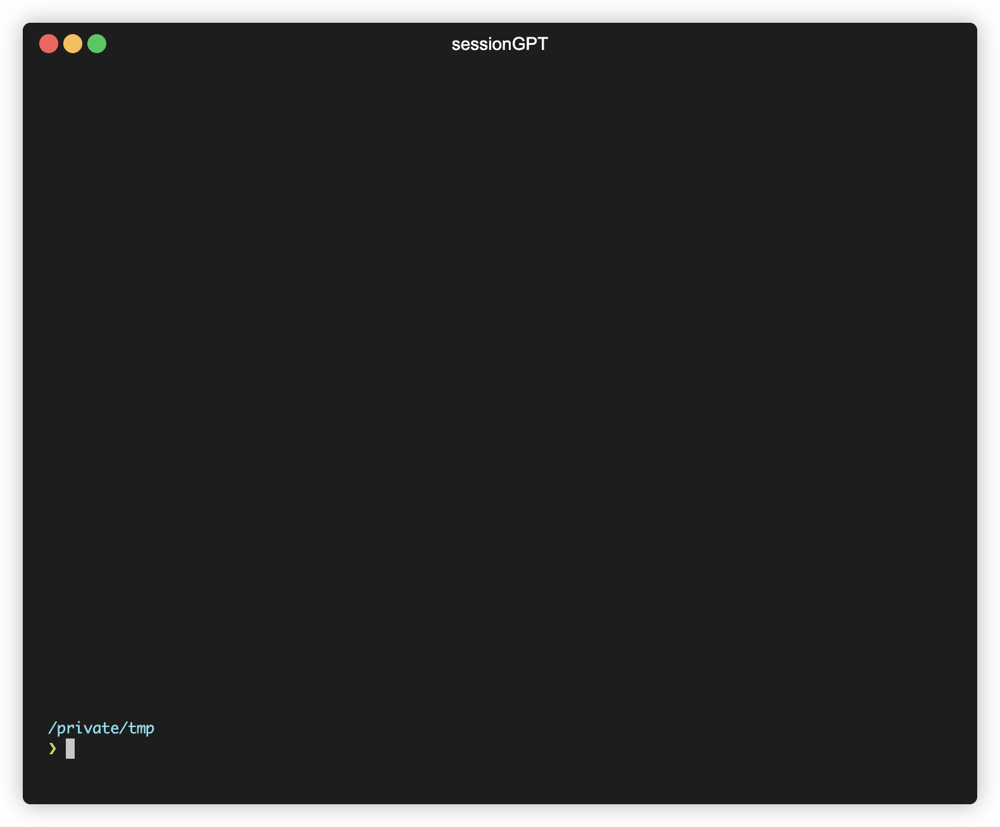

# sessionGPT

Just for fun utility to generate AWS IAM [session policies](https://docs.aws.amazon.com/IAM/latest/UserGuide/access_policies.html#policies_session) using GPT-4.

### Install
```
pip install sessiongpt
```

### Example Usage

```sh
sessiongpt --description "I want to create and manage S3 buckets." --pretty
```


